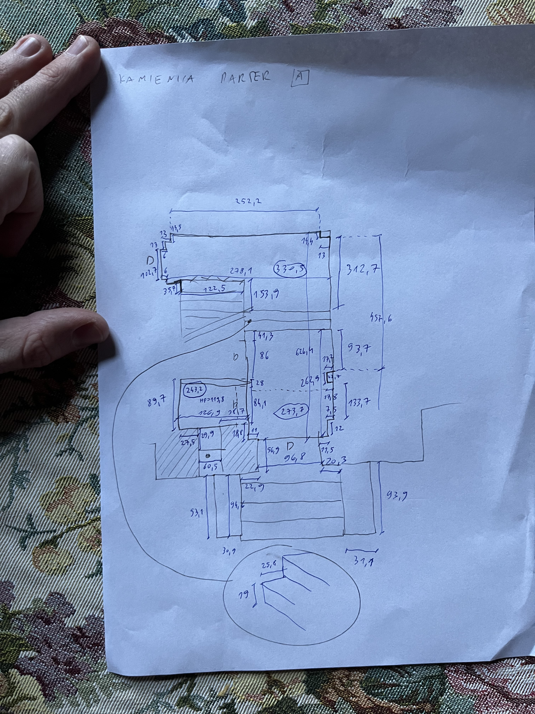
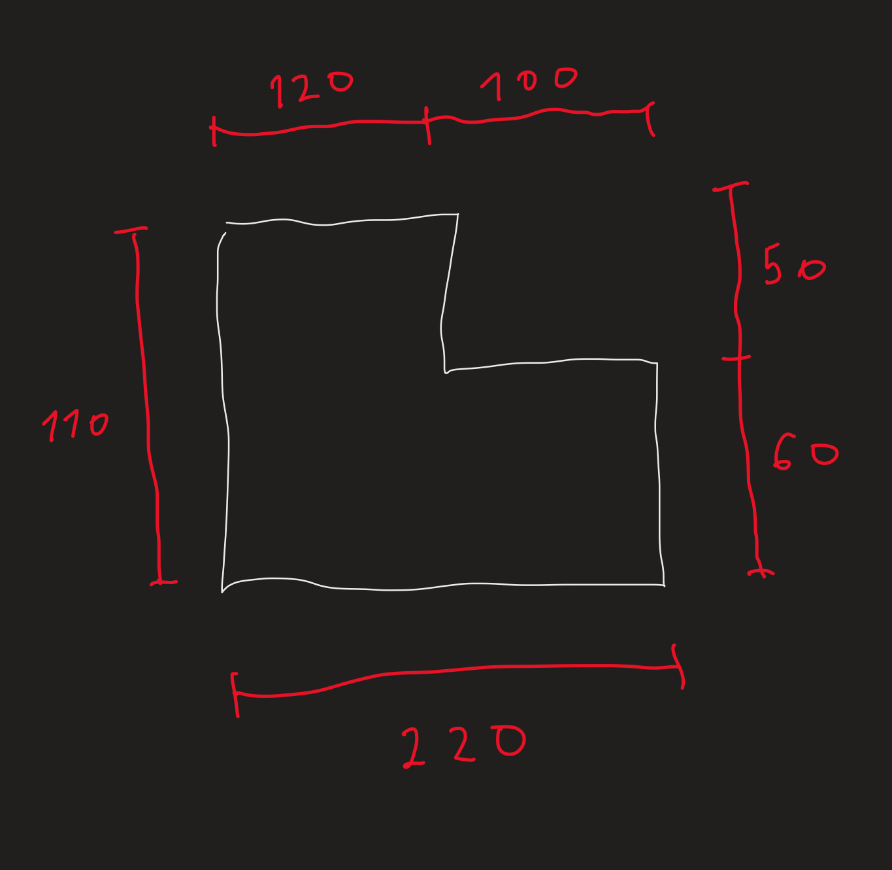
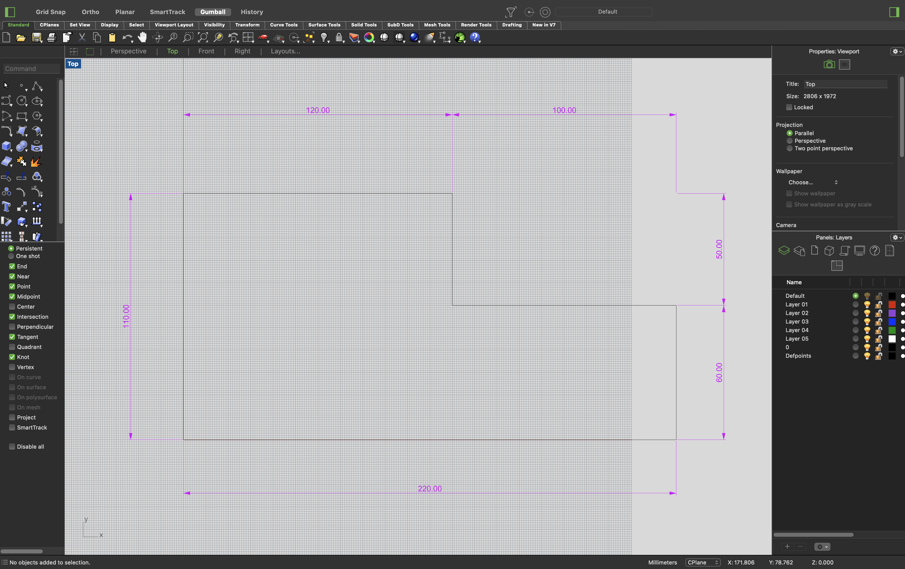

# ArchiAI — Automatic Floor Plan to DXF Conversion

A project that converts hand-drawn simplified floor plans of apartments and architectural objects into DXF files, ready to open in CAD software (AutoCAD, BricsCAD, etc.).

Developed as part of a Python course at the Jagiellonian University.

## Motivation

As an architect, I regularly conduct architectural surveys. One of the first steps is measuring the entire building or unit, then hand-sketching the floor plan on an iPad or A4 sheet. That sketch then has to be manually redrawn in CAD software — a tedious and time-consuming process. I wanted to automate this second step: converting a hand-drawn sketch with dimensions directly into a DXF file.



| Input (hand-drawn sketch) | Output (DXF file in CAD) |
|:---:|:---:|
|  |  |

## Development Process

**Data collection** — I manually drew 63 simplified floor plans containing three object classes (`wall`, `dimension_line`, `dimension_value`), then annotated them (bounding boxes + labels) using Roboflow.

**Digit OCR** — I prepared a custom dataset of ~1,000 hand-written digits (~100 per digit, 0–9). The model alone gave unsatisfactory results, so I combined it with the popular MNIST dataset (60,000 samples) in a two-phase training approach (pretrain + fine-tune), which significantly improved accuracy.

**Matching dimensions to walls** — The initial approach was to correlate recognized values with dimension lines (`dimension_line`) and only then with wall elements. After getting mediocre results, I switched to directly matching dimension values to walls, bypassing the dimension line entirely. This simplification yielded significantly better results.

## Tools

During development I used Claude Code as an assistive tool — the pipeline architecture, design decisions, and data collection are my own work.

## Installation & Quick Start (generating rzut.dxf)

```bash
pip install -r requirements.txt
```

Train the local YOLO model (requires a dataset in `yolo_dataset/` exported from Roboflow in YOLOv8 format):

```bash
python train_yolo.py
cp runs/detect/yolo_floorplan/weights/best.pt yolo_floorplan.pt
```

Run:

```bash
python main.py
```

## How It Works

The system consists of three main modules:

1. **`dataset_creator.py`** — creates training data from sheets of hand-written digits
2. **`trainer.py`** — trains a neural network model (ResNet18) for digit recognition
3. **`train_yolo.py`** — trains a local YOLOv8 model for floor plan element detection
4. **`main.py`** — the main pipeline that processes a floor plan photo into a DXF file

The pipeline uses:

- **YOLOv8 (Ultralytics, local)** — detects walls, dimension lines, and dimension values in the image
- **Custom CNN model (ResNet18)** — recognizes hand-written digits (OCR)
- **OpenCV** — image processing and digit segmentation
- **ezdxf** — generates the CAD file in DXF format

## Requirements

- Python 3.10+
- Libraries listed in `requirements.txt`

## Project Structure

```
projekt-1-inwentaryzacja/
├── main.py                   # Main pipeline (detection → OCR → DXF)
├── train_yolo.py             # Local YOLOv8 model training
├── trainer.py                # Digit recognition model training script
├── dataset_creator.py        # Dataset creation from digit sheets
├── requirements.txt          # Python dependencies
├── test.jpg                  # Sample floor plan for processing
├── digit_ocr_resnet18.pth    # Trained ResNet18 model (~43 MB)
├── yolo_floorplan.pt         # Trained YOLOv8 model (local)
├── dane_projektu.json        # YOLO detection result (bounding boxes, classes, values)
├── rzut.dxf                  # Generated CAD file
│
├── sketches/                 # Sheets with hand-written digits (0.jpg–9.jpg)
├── my_dataset/               # Extracted digit samples (~100 per digit)
│   ├── 0/ ... 9/
├── mnist_data/               # MNIST data (downloaded automatically)
├── debug_digits/             # Debug images — digits extracted from the floor plan
└── roboflow_dataset/         # Hand-drawn floor plan sketches
```

## Preparing Training Data

### 1. Preparing digit sheets

Place 10 photos in the `sketches/` folder (files `0.jpg` to `9.jpg`), where each photo contains many instances of a given digit written by hand on a sheet of paper.

### 2. Extracting samples (`dataset_creator.py`)

```bash
python dataset_creator.py
```

The script processes each sheet:

- Converts the image to grayscale and applies binarization (Otsu)
- Detects contours of individual digits
- Filters out contours that are too small or too large
- Crops and scales each digit to 64×64 px
- Saves samples to `my_dataset/<digit>/`

Result: ~990 training samples (~100 per digit, 0–9).

## Training the OCR Model

```bash
python trainer.py
```

Training proceeds in two phases:

### Phase 1 — Pretraining

- Combines custom data with a subset of MNIST (5,000 samples)
- Custom data is weighted 5× higher than MNIST
- 15 epochs, Adam optimizer, lr=0.0005

### Phase 2 — Fine-tuning

- Training on custom data only
- 25 epochs, lr=0.0001

**Model architecture:**

- Base: ResNet18 with modifications
- Input: 1 channel (grayscale image)
- Output: 10 classes (digits 0–9)
- Regularization: Dropout(0.5)
- Data augmentation: rotation, shear, perspective, blur, brightness adjustment

Result: `digit_ocr_resnet18.pth` file.

## Running the Main Pipeline

```bash
python main.py
```

The program processes `test.jpg` and generates:

- `dane_projektu.json` — detection data with recognized values
- `rzut.dxf` — CAD file with the reconstructed floor plan
- `debug_digits/` — auxiliary images for OCR verification

## Pipeline Step by Step

### Step 1 — Object Detection (YOLO)

The local YOLOv8 model detects three object classes in the floor plan photo:

- **Walls** (`wall`) — rectangular bounding boxes around drawn walls
- **Dimension lines** (`dimension_line`) — lines with arrows indicating a dimension
- **Dimension values** (`dimension_value`) — areas containing hand-written numbers

### Step 2 — Detection Post-processing

- **NMS (Non-Maximum Suppression)** — removes overlapping detections
- **Merging adjacent values** — merges split detections of multi-digit numbers

### Step 3 — Digit Recognition (OCR)

For each detected dimension value:

1. Extract the red channel (dimensions drawn in red)
2. Threshold binarization
3. Segmentation into individual digits (column projection analysis)
4. Resize to 64×64 px
5. Classify each digit using the ResNet18 model
6. Filter by confidence (>70%)
7. Assemble digits into a complete number

### Step 4 — Matching Dimensions to Walls

- Build a wall graph: split into vertical (V) and horizontal (H) walls
- Identify gaps between adjacent walls
- Assign recognized values to the corresponding gaps
- Estimate scale (pixels → real-world units)

### Step 5 — Calculating Coordinates

- Sequentially determine wall positions based on dimensions
- X axis: left to right (based on H gaps)
- Y axis: top to bottom (based on V gaps)

### Step 6 — Closing the Floor Plan

- Identify unconnected wall endpoints
- Use unassigned dimensions to extend walls
- Draw closing segments

### Step 7 — Export to DXF

Generate a CAD file with line segments representing walls, compatible with AutoCAD and other CAD software.

## Input and Output Files

| File | Type | Description |
| -------------------- | ------- | ------------------------------------------ |
| `test.jpg` | input | Photo/scan of the architectural floor plan |
| `digit_ocr_resnet18.pth` | model | Trained ResNet18 model for OCR |
| `dane_projektu.json` | output | YOLO detection results + recognized values |
| `rzut.dxf` | output | Reconstructed floor plan in CAD format |
| `debug_digits/` | output | Debug images of extracted digits |
